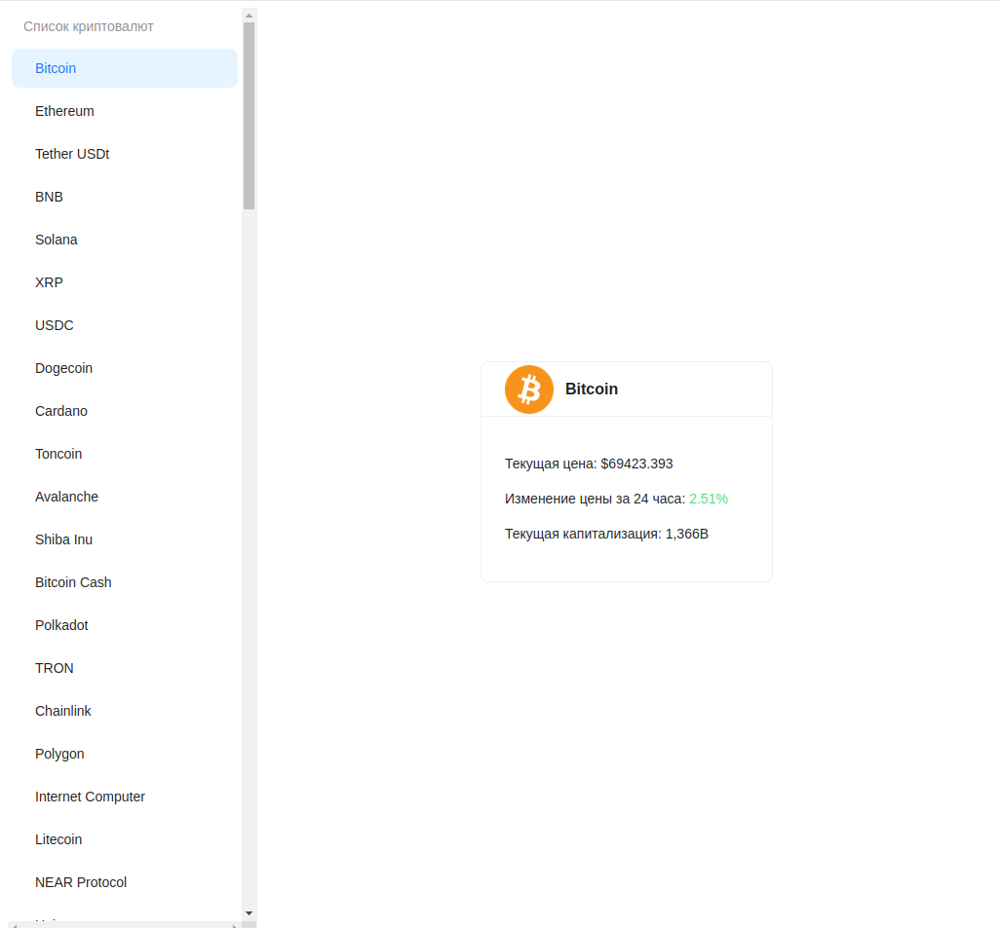

# Crypto Tracker

## Stack:
- FastAPI + aiohttp, pydantic, pydantic-settings
- React + axios, ant design, tailwind

### Instructions
#### Backend
- `python3 -m venv venv`
- `.venv/bin/activate` or `.venv\Scripts\activate.bat`
- `pip install -r requirements.txt`
- `uvicorn src.main:app --reload` (in backend directory)

#### Frontend
- `npm create vite@latest`
- `npm install`
- `npm run dev`